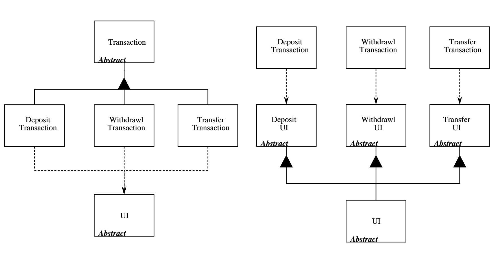

# Software Engineering Principles

Compiled from CS2103 lecture notes, as well as [Principles Wiki](http://principles-wiki.net/).

## Dependency Inversion Principle (DIP)
A simplified description of DIP is that a variable declaration should always have the (static) type of an `abstract` class or `interface`. By doing so a module depends only on this abstraction. The concrete subclass realizing the details is referenced only once, namely when it is instantiated.

The more elaborate definition by Robert C. Martin reads as follows:
> 1. High-level modules should not depend on low-level modules. Both should depend on abstractions.
> 2. Abstractions should not depend on details. Details should depend on abstractions.

The following diagram shows the classical approach. A high-level module `A` uses a low-level module `B`, as follows:

When applying DIP, both modules depend on the abstraction:

B is not depended upon anymore but it depends on another module. This is the inverted dependency.

## Interface Segregation Principle (ISP)
> No client should be forced to depend on methods it does not use.

When clients are forced to depend upon interfaces that they don’t use, then those clients are subject to changes to those interfaces. This results in an inadvertent coupling between all the clients. Said another way, when a client depends upon a class that contains interfaces that the client does not use, but that other clients do use, then that client will be affected by the changes that those other clients force upon the class. We would like to avoid such couplings where possible, and so we want to separate the interfaces where possible.

ISP **splits interfaces that are very large** into smaller and more specific ones so that clients will only have to know about the methods that are of interest to them. Such shrunken interfaces are also called role interfaces. ISP is intended to keep a system decoupled and thus easier to refactor, change, and redeploy.

*Image from [Object Mentor](https://drive.google.com/file/d/0BwhCYaYDn8EgOTViYjJhYzMtMzYxMC00MzFjLWJjMzYtOGJiMDc5N2JkYmJi/view).*

## Law of Demeter/Principle of Least Knowledge
> - An object should have limited knowledge of another object.
> - An object should only interact with objects that are closely related to it.

Given a method `m` of an object `o`, it should only invoke the following:

- `o` itself
- Objects passed as parameters to `m`
- Objects created/instantiated in `m`
- Objects from the direct association of `o`

Limiting the interaction to a closely related group of classes aims to reduce coupling.

## Likov's Substitution Principle (LSP)
> Subtypes must be substitutable for their base types.

Or, from the lecture notes:

> If a program module is using a sub-class, then the reference to the super-class can be replaced with a sub-class without affecting the functionality of the program module. 

In other words, a subclass' overriden method from its superclass must not contradict that in the superclass. LSP demands that a subtype has to be constructed in a way that it behaves like the supertype if it is called through the supertype interface.

This ensures the following:
- Only strengthen invariants in subclasses; never weaken them
- Only weaken preconditions when overriding methods
- Only strengthen postconditions when overriding methods

## Open-Closed Principle
> A module should be open for extension but closed for modification.

Modules should be written so that they can be extended, without requiring them to be modified. In other words, changing what the modules do without changing the source code of the modules.

Consider a `CommandQueue` which acts upon `Command`s (an interface). Assuming we only have `Find` and `Add` commands currently and `CommandQueue` is already implemented using the OCP, then we can simply add more commands alongside the current ones, and `CommandQueue` can now perform additional commands without modifying `CommandQueue` code. Its behaviour was extended without modification.

Another example using Java Generics:  The behavior of a template/generic class can be altered by passing it a different class as a parameter. The `ArrayList` class can behave as a container of `Student`s in one instance and as a container of `Admin` objects in the other instance, without having to change its code. That is, the behavior of the `ArrayList` class is extended without modifying its code.

## Separation of Concerns
> A program should be separated into modules, each tackling distinct concerns.

Very similar to [Single Responsibility Principle](#single-responsibility-principle-srp).

## Single Level of Abstraction Principle (SLAP)
Each method should be written in terms of a single level of abstraction. If there is a statement which belongs to a lower level of abstraction, it should go to a private method which comprises statements on this level.

Often the body of a loop can be extracted resulting in a separate private method.

## Single Responsibility Principle (SRP)
The Single Responsibility Principle states that:
> A class should have one, and only one, reason to change.

If a class has more than one responsibility, then the responsibilities become coupled. Changes to one responsibility may impair or inhibit the class' ability to meet the others. This kind of coupling leads to fragile designs that break in unexpected ways when changed.
