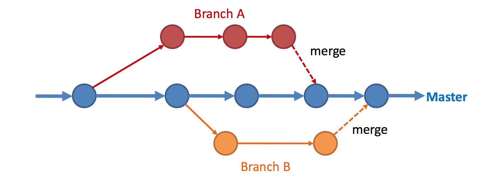

# CS2103 Lecture 2.3: Revision Control

## Introduction to revision control
> Revision control is the process of managing multiple versions of a piece of information. In its simplest form, this is something that many people do by hand: every time you modify a file, save it under a new name that contains a number, each one higher than the number of the preceding version.

### Why use revision control:
- It will track the history and evolution of your project, so you don't have to.
- RCS makes it easier for you to collaborate.
- It can help you to recover from mistakes.
- It will help you to work simultaneously on, and manage the drift between, multiple versions of your project.

### Other names of RCS:
- Revision control system (RCS)
- Software configuration management (SCM), or configuration management
- Source code management
- Source code control, or source control
- Version control system (VCS)

## Glossary of terms
- **Repository (Repo)**: The database where the files and historical data are stored, including the author of the changes and the summary of each change.
- **Init**: Initialize a repository in a directory so that the RCS can start version tracking the files in that directory.
- **Working directory**: The local directory of your files.
- **Ignore**: Requesting the RCS not to track the versions of a file. This is usually used for binary files such as executables and generates files such as logs.
- **Stage**: Take a copy of a file in preparation to save its current version in the version history.
- **Add**: Request the RCS to start tracking the versions of a file.
- **Commit (verb)**: Storing the staged files in the permanent version history.
- **Commit/Revision/Changeset**: The object containing the copies of the staged files at the point of committing, and other meta data.
- **Diff**: The differences between two specific versions.
- **Remove**: Asking the RCS to stop tracking a file.
- **Tag (noun)**: A label added to a commit for easy reference.
- **Tag (verb)**: Adding a tag to a commit
- **Checkout commit**: Update the working directory to match a commit
- **Stash**: Store not-yet-ready-to-be-committed changes in a temporary location, to be retrieved later.
- **Clone**: Creates a copy of a repo. For example, a local repo can be created by cloning a remote repo.
- **Push**: Uploads the revision history to another repo. Typically, only the commits previously not pushed will be uploaded.
- **Pull**: Downloads the revision history from another repo. Typically, only the commits previously not pulled will be downloaded.

## RCS Models

### Centralized RCS (CRCS)
In this model, there is a central remote repo shared by the team, and all commits are made to the central repo. 

e.g. CVS, SVN, Perforce 

#### Typical Workflow
- **Pull** any changes from the central server
- Make changes locally
- **Commit** changes to the central server

### Distributed/Decentralized RCS (DRCS)
In this model, there can be multiple remote repos and pulling and pushing can be done among them in arbitrary ways. These systems do not necessarily rely on a central server to store all the versions of a project’s files. Instead, every developer “clones” a copy of a repository and has the full history of the project on their own hard drive. This copy (or “clone”) has all of the metadata of the original.

One common misconception about distributed version control systems is that there cannot be a central project repository. This is simply not true – there is nothing stopping you from saying "this copy of the project is the authoritative one." This means that instead of a central repository being required by the tools you use, it is now optional and purely a social issue.

e.g. Git, Mercurial, Bazaar

#### Advantages of DRCS
- Performing actions other than pushing and pulling changesets is extremely fast because the tool only needs to access the hard drive, not a remote server.
- Committing new changesets can be done locally without anyone else seeing them. Once you have a group of changesets ready, you can push all of them at once.
- Everything but pushing and pulling can be done without an internet connection. So you can work on a plane, and you won’t be forced to commit several bugfixes as one big changeset.
- Since each programmer has a full copy of the project repository, they can share changes with one or two other people at a time if they want to get some feedback before showing the changes to everyone.

#### Disadvantages of DRCS
- If your project contains many large, binary files that cannot be easily compressed, the space needed to store all versions of these files can accumulate quickly.
- If your project has a very long history (50,000 changesets or more), downloading the entire history can take an impractical amount of time and disk space.

## Git Workflow

### Using DRCS in a centralized way
1. **Clone** the remote repo to create a local copy of the repo.
2. **Commit** any changes to the local repo.
3. **Push** the commits to the remote repo.
4. Other users can then **pull** from the remote repo, while **merging** or fixing any **merge conflicts** to unpushed changes.

### Branching and Merging
Branching and merging are two terms that are often used in team-based RCS usage. Conceptually, branching is the process of evolving multiple versions of the software in parallel. For example, one team member can create a new branch and add an experimental feature to it while the rest of the team keeps working on the master. 'Master' refers to the main line of development while 'branches' are other variants of the software being developed in parallel. A branch usually contains multiple commits. Once the experimental feature is stable, that branch can be merged to the master.

The workflow can then be seen as follows:

1. Create a new **branch** from `master`.
2. Add some **commits** to the branch.
3. If using a remote repo service like [GitHub](https://github.com), **push** the branch to the remote repo and create a **pull request** to `master`.
4. Allow other teammates to review the PR and merge it into `master`.